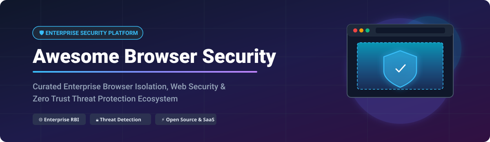

# 🛡️ Awesome Browser Security Platform 🌐

  

  
  
  
  
  

---

## 🚀 Top Browser Security Platform & Remote Browser Isolation Ecosystem

**Curated List of SaaS Products & Open-Source GitHub Projects**  
*Focused on Enterprise Browser Security, Remote Browser Isolation (RBI), Secure Web Access, Zero Trust Web Browsing, and Data Loss Prevention (DLP)*

📅 **Last updated:** September 2026

---

### 💡 Overview & SEO Highlights
Welcome to the comprehensive curated directory of **Enterprise Browser Security** and **Remote Browser Isolation (RBI)** solutions. Modern organizations face increasing cyber threats from phishing, malware, ransomware, credential harvesting, and data exfiltration through web browsers. 

This guide tracks leading commercial enterprise browser platforms (such as Island, Menlo Security, Palo Alto Prisma Access Browser, and Google Chrome Enterprise Premium) as well as powerful open-source security tools, sandboxed browser environments, and browser extension EDR systems for security teams, enterprise architects, and developers.

---

## 📑 Table of Contents
- [🏢 SaaS/Hosted Platforms](#-saashosted-platforms)
- [🔓 Open-Source GitHub Projects](#-open-source-github-projects)
- [🛠️ Frameworks for Custom Browser Security](#%EF%B8%8F-frameworks-for-building-custom-browser-security-solutions)
- [🤝 How to Contribute](#-how-to-contribute)
- [☕ Support & Sponsorship](#-support--sponsorship)
- [⚠️ Disclaimer](#%EF%B8%8F-disclaimer)
- [📈 Star History](#-star-history)

---

## 🏢 SaaS/Hosted Platforms

The global **Enterprise Browser & Browser Security market** is estimated at **$3.40 Billion - $5.40 Billion in 2025** (projected to reach **$8.46B - $18.40B by 2030-2034** at a CAGR of ~20%). The sector is currently **highly fragmented**, split between standalone enterprise browsers (e.g. Island), browser security extensions (e.g. LayerX, Seraphic), and Remote Browser Isolation (RBI) integrated into SASE/Zero Trust platforms.

| Product | Description | Company Size (Valuation / Revenue / Market Cap) | Pricing (Starting Tier) | Free Tier Limit / Trial |
| :--- | :--- | :--- | :--- | :--- |
| **[Google Chrome Enterprise Premium](https://chromeenterprise.google/)** | Enterprise version of Chrome with advanced security controls, DLP, and context-aware access. | **$2.45 Trillion** Market Cap (Alphabet) | **$6 per user/month** | **60-day free trial** (up to 5,000 users) |
| **[Cisco Secure Browser / Access](https://www.cisco.com/)** | Enterprise browser security and Zero Trust Access integrated into Cisco's security portfolio. | **$421 Billion** Market Cap (Cisco) | **$3 per user/month** (Security Cloud base) | **30-day free trial** upon request |
| **[Palo Alto Prisma Access Browser](https://www.paloaltonetworks.com/)** | Enterprise browser integrated with Prisma Access for SASE-native security and data protection (includes Talon Cyber Security, acquired for $625M). | **$306 Billion** Market Cap (Palo Alto Networks) | **$7 per user/month** (Prisma SASE tier) | **30-day Proof-of-Concept (POC)** via sales |
| **[Cloudflare Browser Isolation](https://www.cloudflare.com/)** | Browser isolation integrated with Cloudflare Zero Trust for threat protection and data governance. | **$125 Billion** Market Cap (Cloudflare) | **$10 per user/month** (Add-on to $7/user Zero Trust base) | **Free tier up to 50 users** (Zero Trust base); demo for RBI |
| **[Netskope Browser Isolation](https://www.netskope.com/)** | Remote browser isolation integrated with Netskope's SASE platform for threat protection and data loss prevention. | **$7.5 Billion** Market Cap / **$845M ARR** | **$60 per user/month** (Comprehensive SASE bundle) | **Interactive Hands-On Test Drive / Lab** |
| **[Island](https://www.island.io/)** | Enterprise browser built on Chromium with built-in DLP, secure web access, and identity controls. Over 2 million browsers deployed. | **$6.4 Billion** Valuation / **$200M ARR** | **$25,000 per year** (MSP starting tier) / ~$10/user/mo | **Custom Demo / 14-day evaluation** upon request |
| **[Citrix Secure Browser](https://www.citrix.com/)** | Cloud-based browser isolation service integrated with Citrix Workspace & Secure Private Access. | **$4.0 Billion** Revenue (Privately Held via Vista/Evergreen) | **$7 per user/month** (Secure Private Access tier) | **60-day free trial** via Citrix Cloud console |
| **[Material Security Browser](https://material.security/)** | Browser security platform focused on email, Workspace, and data protection. | **$1.1 Billion** Valuation | **$4 per user/month** (Essentials plan) | **Risk-free Proof-of-Concept / Guided Demo** |
| **[Menlo Security](https://www.menlosecurity.com/)** | Cloud-based isolation platform eliminating web-based threats by executing all browsing activity in disposable containers. | **$800 Million** Valuation / **$100M ARR** | **$1,450 per user/year** (Enterprise tier estimate) | **Custom Demo / Guided Trial** via sales |
| **[Seraphic Security](https://seraphicsecurity.com/)** | Enterprise browser security platform extending protection to any browser; acquired by CrowdStrike for $420M (Falcon Seraphic Browser). | **$420 Million** Acquisition Value (by CrowdStrike) | **$15 per user/month** (Falcon addon tier) | **15-day CrowdStrike Falcon Free Trial** |
| **[LayerX Security](https://layerxsecurity.com/)** | Browser security platform providing visibility, governance, and threat protection across enterprise browsers; acquired by Akamai for $205M. | **$205 Million** Acquisition Value (by Akamai) | **$5 per user/month** (Workforce Protector tier) | **Custom Demo / Evaluation Trial** via Akamai |
| **[Authentic8 Silo](https://www.authentic8.com/)** | Cloud-based isolated browser providing secure, anonymous web access for threat research and high-risk browsing. | **$100 Million** Estimated Revenue | **$1,450 per user/year** ($121/mo, Local tier) | **30-day free trial** |
| **[Ericom Shield](https://www.ericom.com/)** | Remote browser isolation platform eliminating web-based threats through containerized browsing; acquired by Cradlepoint / Ericsson. | **$16.1 Million** Revenue (Part of Cradlepoint/Ericsson) | **$6 per user/month** (NetCloud Threat Defense tier) | **Custom Evaluation Trial** upon request |

---

## 🔓 Open-Source GitHub Projects

Below are active open-source projects for self-hosting, custom browser isolation, privacy hardening, and browser security extensions. Sorted by **GitHub Stars_Count** (descending).

| Project & Repository | GitHub_Stars | Category & Key Features |
| :--- | :--- | :--- |
| **[browser-use](https://github.com/browser-use/browser-use)** |  | **Agent Sandbox & Automation**: Open-source web browser automation framework with isolated execution contexts for AI agents and secure web interaction. |
| **[BeEF (Browser Exploitation Framework)](https://github.com/beefproject/beef)** |  | **Security Testing & Assessment**: Penetration testing tool focused on client-side browser vulnerabilities, XSS vectors, and security assessment. |
| **[Ungoogled Chromium](https://github.com/ungoogled-software/ungoogled-chromium)** |  | **Hardened Privacy Browser**: Lightweight drop-in replacement for Chromium stripped of background requests to Google services, enhanced with privacy tweaks. |
| **[BrowserBox](https://github.com/BrowserBox/BrowserBox)** |  | **Remote Browser Isolation**: Leading open-source web application virtualization platform via zero-trust RBI, multiplayer embeddable browsers, and secure document gateways. |
| **[Hardentools](https://github.com/securitywithoutborders/hardentools)** |  | **Endpoint & Browser Hardening**: Security utility disabling risky features in OS and browser settings to reduce attack surfaces against web threats. |
| **[KubeBrowse](https://github.com/browsersec/KubeBrowse)** |  | **Kubernetes RBI Platform**: Ephemeral sandboxed browsing environments running in isolated containers with real-time threat analysis and automated session cleanup. |
| **[SithScanner](https://github.com/Farhann0x6d/SithScanner)** |  | **In-Browser EDR Extension**: Extension detecting clipboard abuse, LOLBins, and obfuscated payload execution (ClickFix campaigns) directly inside modern browsers. |
| **[Iridium Browser](https://iridiumbrowser.de/)** |  | **Enterprise Hardened Browser**: Chromium-based privacy-hardened browser preventing automatic data transmission, offering MSI deployment packages. |
| **[Osprey: Browser Protection](https://github.com/osprey-project/osprey)** |  | **Threat Detection Extension**: GPLv3 open-source browser extension checking sites against 20+ threat-intelligence providers via privacy proxy. |
| **[SOC Toolkit](https://github.com/gabrieljabour/soc-toolkit)** |  | **Analyst Investigation Tool**: Open-source browser extension providing rapid IOC lookups, WHOIS analysis, IP reputation, and hash lookup tools for SOC teams. |
| **[Lucent — Browser Audit](https://github.com/DevextCorp/lucent)** |  | **Security & Privacy Audit**: Browser extension evaluating 16 security settings and real-time JavaScript fingerprinting behavior locally without data leakage. |
| **[ssbapp (Site-Specific Browser)](https://github.com/eyedeekay/go-fpw)** |  | **Isolated Profile Utility**: CLI utility spawning site-specific Firefox instances with separate profile directories and private browsing defaults. |

---

### 🛠️ Frameworks for Building Custom Browser Security Solutions
Security teams can combine these open-source building blocks:
- Use **[BrowserBox](https://github.com/BrowserBox/BrowserBox)** or **[KubeBrowse](https://github.com/browsersec/KubeBrowse)** for containerized Remote Browser Isolation.
- Deploy **[SithScanner](https://github.com/Farhann0x6d/SithScanner)** or **[Osprey](https://github.com/osprey-project/osprey)** for extension-based threat detection and EDR analysis.
- Utilize **[Ungoogled Chromium](https://github.com/ungoogled-software/ungoogled-chromium)** or **[Iridium](https://iridiumbrowser.de/)** for corporate desktop privacy-hardened browser deployments.

---

## 🤝 How to Contribute

Contributions are welcome! Help us keep this directory accurate and updated:
1. **Fork** this repository.
2. Add or update entries in `README.md` maintaining table formatting.
3. Ensure details include factual descriptions, vendor size/pricing, and official GitHub/product links.
4. Submit a **Pull Request** with a clear explanation of changes.

For curated meta-lists, explore [Awesome-Awesome-Awesome](https://github.com/ishandutta2007/Awesome-Awesome-Awesome).

---

## ☕ Support & Sponsorship

If you find this repository helpful in evaluating browser security architectures, please consider starring ⭐ the repository, sharing it with colleagues, or sponsoring the project!

- ⭐ **Star this repository** to show your support.
- 🔀 **Fork & Share** with your security engineering teams.
- ☕ **Buy me a coffee / Sponsor**: Support ongoing maintenance on the [GitHub Sponsor Dashboard](https://github.com/sponsors/ishandutta2007).

---

## ⚠️ Disclaimer

- This repository provides a **community-curated overview** — it is not an endorsement or exhaustive audit of listed products.
- All enterprise browser security products must comply with organizational security policies and global regulatory frameworks (GDPR, CCPA, HIPAA).
- Self-hosted open-source isolation platforms require dedicated compute resources and security hardening for production environments.

---

## 📈 Star History

---

  <b>Made for security engineers, enterprise architects, and browser security professionals.</b> 
  Let's make browser security more open, transparent, and resilient. 🛡️✨

